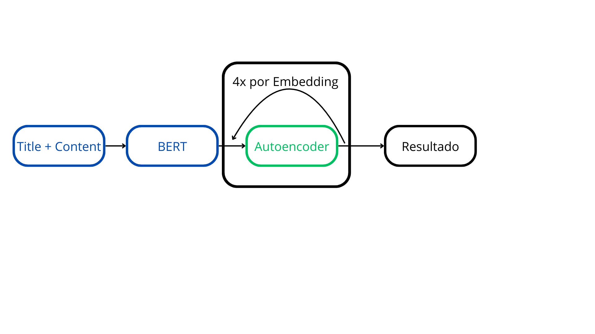
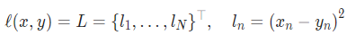
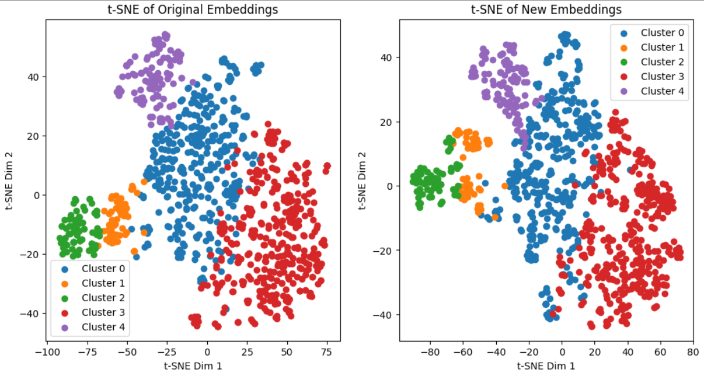
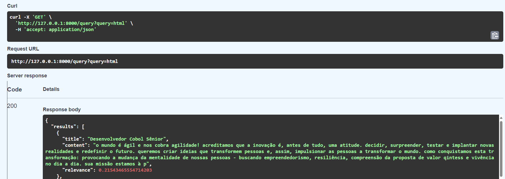

# NLP-APS-2

# Etapa 1: Encontrando embeddings

## Descrição do Dataset

O dataset possui duas colunas, "title" e "content". A coluna "title" representa o título ou nome da vaga de desenvolvedor de software. A coluna "content" possui todas as informações, requisitos, benefícios e o que for relevante sobre a vaga em questão.

## Processo de geração dos embeddings

Foi importado o modelo e o tokenizador do BERT do PyTorch. Foi feita uma função que gera os embeddings com base no tokenizador. Para cada conteúdo, é gerado um embedding. Cada embedding gerado no BERT passa 4 vezes pelo Autodecoder para ter suas dimensões reduzidas e possivelmente ficarem mais relevantes.

A topologia da rede neural pode ser vista abaixo:


Os hiperparâmetros utilizados foram dimensão dos embeddings, autoencoder, critério e otimizador.

## Processo de treinamento

Foi utilizado no autocoder um encoder sequencial de 3 camadas: nn.Linear(embedding_dim, 128), nn.ReLU() e nn.Linear(128, 64), além de um decoder sequencial de 3 camadas também nn.Linear(64, 128), nn.ReLU() e nn.Linear(128, embedding_dim). O número 128 é para quantas camadas quero que o embedding seja transformado, ao invés do padrão 768 do BERT. Para treinar o autoencoder, utilizou-se como critério e método de perca o MSE, que é o erro quadrado médio entre o que entrou no encoder e o que saiu no decoder. O MSE foi usado pois ele deixa os erros mais significativos com maior destaque, tendo em vista que eleva ao quadrado. Para otimizar, foi utilizado o método Adam para adaptar a taxa de aprendizagem, com learning rate (rt) = 0.001.

A equação do MSE pode ser vista a seguir:



# Etapa 2: Visualizando os embeddings

A mudança com o tunelamento mencionado na etapa anterior não trouxe resultados significantemente diferentes entre si, como pode ser visto na imagem a seguir:



Nota-se uma alteração no cluster 2, em que ele quase alcançava o -100 nas abscissas e ficava abaixo de 0 nas ordenadas. Porém, os embeddings na versão com tunelamento estão mais próximos do valor -80 nas abscissas e 0 nas ordenadas. Em relação ao cluster 1, ele estava entre 0 e -20 na versão original, e ficou entre -10 e 20 na nova. Ambos clusters 1 e 2 parecem ter se modificado, mas foi possível descobrir se o conteúdo/tema deles se alterou.

Ademais, é visualmente perceptível que não ocorreu uma mudança significativa na identificação dos demais clusters entre as duas versões.

# Etapa 3: Testando o sistema de pesquisa

Resultado para a query "html":

```
{
  "results": [
    {
      "title": "Desenvolvedor Cobol Sênior",
      "content": "o mundo é ágil e nos cobra agilidade! acreditamos que a inovação é, antes de tudo, uma atitude. decidir, surpreender, testar e implantar novas realidades e redefinir o futuro. queremos criar ideias que transformem pessoas e, assim, impulsionar as pessoas a transformar o mundo. como conquistamos esta transformação: provocando a mudança da mentalidade de nossas pessoas - buscando empreendedorismo, resiliência, compreensão da proposta de valor qintess e vivência no dia a dia. sua missão estamos à p",
      "relevance": 0.21543465554714203
    },
    {
      "title": "Desenvolvedor Java/Spring Boot - Pleno/Sênior",
      "content": "responsabilidades: requisitos:",
      "relevance": 0.21543465554714203
    },
    {
      "title": "P&d | desenvolvedor (a) p&d -inteligência artificial e visão computacional",
      "content": "somos especializados no desenvolvimento e fabricação de rpa (remotely piloted aircrafts), sendo a maior empresa brasileira e latino-americana do segmento. fazer parte do surgimento e da consolidação de uma nova tecnologia, contribuir para seu aprimoramento e impactar vidas nos enche de orgulho e de vontade de querer fazer sempre mais. não é ficção, realmente fazemos robótica! atualmente, a companhia conta com mais de 500 colaboradores, xmobotianos (as) que visam tornar a robótica móvel uma reali",
      "relevance": 0.20180587470531464
    },
    {
      "title": "Desenvolvedor HCL Full Stack com Especialização em Site Builder",
      "content": "somos a maior multinacional brasileira e estamos entre as 100 maiores empresas de ti do mundo. estamos presentes em 41 países com +30k colaboradores. a stefanini tem como principal objetivo auxiliar os clientes a encontrar, por meio de soluções personalizadas, a maneira ideal para alcançar seus desafios, impulsionando a inovação digital. e queremos mais! buscamos profissional versátil e experiente em desenvolvimento de software, com especialização na plataforma hcl e profundo conhecimento tanto ",
      "relevance": 0.16796767711639404
    },
    {
      "title": "Desenvolvedor Full Stack",
      "content": "diferenciais: formação: horário de trabalho: sálario: escolaridade mínima:",
      "relevance": 0.16678853332996368
    },
    {
      "title": "Specialist Software Engineer",
      "content": "garantir a qualidade das entregas através de testes automatizados e observabilidade através de instrumentação do código; desenvolver sistemas baseado nos princípios de engenharia da unico (soluções simples, rápidas, seguras, escaláveis, mensuráveis, resilientes e que serão lembradas); atuar ativamente em discussões e decisões do produto ajudando no direcionamento técnico; garantir a simplicidade, eficiência, manutenibilidade e reaproveitamento de código; propor melhorias, novas tecnologias e nov",
      "relevance": 0.1608075350522995
    },
    {
      "title": "Desenvolvedor Web Pleno",
      "content": "responsabilidades: requisitos:",
      "relevance": 0.12015296518802643
    },
    {
      "title": "2024-034 desenvolvedor jr.",
      "content": "requisitos: automotivado, apaixonado por tecnologia, interessado em evoluir como desenvolvedor, goste de trabalhar em grupo e conhecimentos de desenvolvimento de software, para servidores, nuvem e ou mobile. desejável: como pessoa desenvolvedora, você trabalhará no desenvolvimento de novas funcionalidades para o sistema de gerenciamento do fluxo de tráfego aéreo brasileiro. nesta função, você irá: conhecimentos em backend e frontend web, sistemas em nuvem, uso de containers. javascript / typescr",
      "relevance": 0.12015296518802643
    },
    {
      "title": "Desenvolvedor Cobol Sênior",
      "content": "o mundo é ágil e nos cobra agilidade! acreditamos que a inovação é, antes de tudo, uma atitude. decidir, surpreender, testar e implantar novas realidades e redefinir o futuro. queremos criar ideias que transformem pessoas e, assim, impulsionar as pessoas a transformar o mundo. como conquistamos esta transformação: provocando a mudança da mentalidade de nossas pessoas - buscando empreendedorismo, resiliência, compreensão da proposta de valor qintess e vivência no dia a dia. sua missão estamos à p",
      "relevance": 0.12015296518802643
    },
    {
      "title": "Dev Fullstack Pl - Projeto Internacional",
      "content": "o que vamos construir juntos? essa posição é para trabalhar em um projeto internacional. são equipes globais e estão em vários lugares no mundo, proporcionando uma boa conexão com diversas culturas e perfis. é uma boa oportunidade para atuar com a metodologia ágil, que faz parte do nosso dia a dia! trabalharemos juntos para construir melhores cenários e desenvolver boas soluções. nossa equipe está procurando um desenvolvedor fullstack para se juntar ao nosso grupo. nosso roteiro está cheio de op",
      "relevance": 0.12015296518802643
    }
  ],
  "message": "OK"
}
```
Como podemos ver na imagem a seguir:

